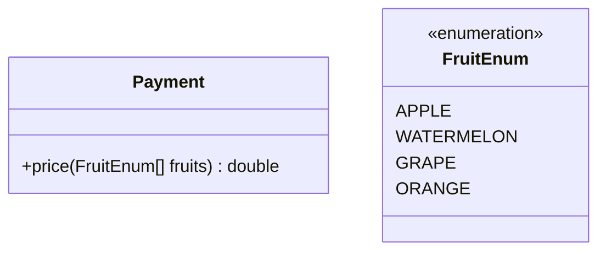

# Fruit Store

Tenemos un método que recibe por parámetro una lista de frutas y devuelve el precio total.

```mermaid
classDiagram
    class Payment {
        +price(FruitEnum[] fruits) double
    }
    class FruitEnum {
        <<enumeration>>
        APPLE
        WATERMELON
        GRAPE
        ORANGE
    }
```